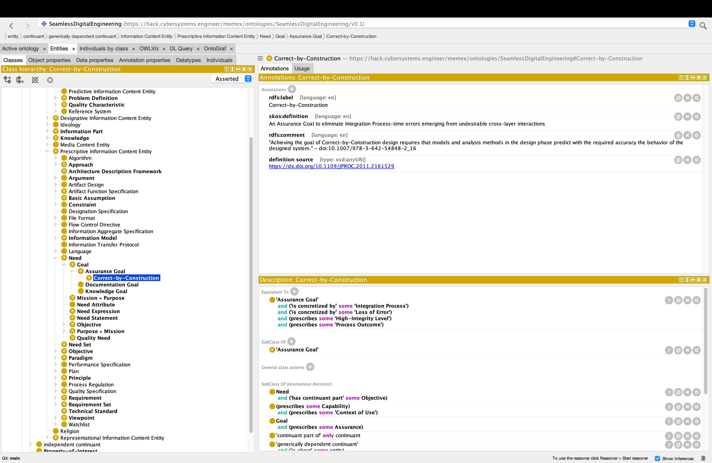

# Seamless Digital Engineering Ontology

Ontology for Seamless Digital Engineering,  based on Common Core Ontologies (CCO) and Basic Formal Ontology (BFO) (ISO/IEC/IEEE 21838-2:2021)

## Table of Contents

1. [Concepts](#concepts)
2. [Usage](#usage)
2. [Publications](#publications)
3. [Contributing](#contributing)
4. [License](#license)

## Concepts

This ontology contains concepts in the systems, software, and digital engineering domains, based on the following international standards:

- ISO/IEC/IEEE 15288 — Systems and software engineering — System life cycle processes
- ISO/IEC 25000-series — Systems and software engineering — Quality Requirements and Evaluation (SQuaRE)
- ISO/IEC/IEEE 15026 — Systems and software engineering — Systems and software assurance
- ISO/IEC/IEEE 42000-series — Software, systems and enterprise — Architecture description and processes
- ISO/IEC 15408 — Information security and cybersecurity — Evaluation criteria for IT security ("Common Criteria") 
- ISO/IEC/IEEE 24641 — Systems and software engineering — Methods and tools for MBSSE

See [Publications](#Publications) for a full listing, or refer to the 'definition source' annotations in the OWL file.

## Usage

For best usage of this ontology, clone the repository using the following command:

```
git clone --recurse-submodules https://github.com/systems-praxis/seamless-digital-engineering-ontology
```

### Opening the ontology

Open the `SeamlessDigitalEngineering.owl` file in [Protégé](https://protege.stanford.edu/). If Protégé is installed correctly, it will begin to load the imported ontologies, including CCO and the [Basic Formal Ontology (BFO)](https://github.com/BFO-ontology/BFO-2020), and parse each file located at its canonical [IRI](https://www.w3.org/TR/owl2-syntax/#IRIs), adding its definitions to the current ontology view.

Some Protégé plugins should be installed from the Protégé start-up or File > Check for plugins dialog, including: the ELK reasoner, OWLViz, and OntoGraf. Queries may be run using the SPARQL Query and DL Query plugins. The reasoner must be set from the Reasoner top-level menu, started, and synchronized (some warning messages will appear in the Protégé log indicating the reasoner cannot check everything). The other plugins may be used by activating them in the Window top-level menu, under Tabs.



### Exploring the ontology

The Entities tab is the main entry into the ontology, starting with the Classes tab under it. This class hierarchy view on the left shows the computed hierarchy of the imports closure of the active ontology. Imported classes are shown in normal font, while new classes are shown in bold; imported classes with new annotations are also shown in bold. Gradually uncollapse the class hierarchy, and select any class to view its details. Annotations of the selected class are shown in the top-right pane, and the axiomatic descriptions of the class are shown in the bottom-right pane.

The 4 icons to the right of each row in the description pane provide the following capabilities: Explain (?), Annotations (@), Remove (X), and Edit (O). The edit capability allows you to create or edit description logic expressions, and supports tab completion (write a name fragment, then press the tab key to complete the name or provide a list of options).

The "Object properties" tab shows the computed hierarchy of the imports closure of object properties, which are like relation types. Most object properties have a definition, inverse, domain and range. In the description logic Manchester syntax that Protégé uses, object properties are at the front of a parenthesized region, before the cardinality and class/individual. Ontology usages of classes and object properties may be found in the Usages tab in the top-right pane, with their labels being navigation links.

The remaining tabs should be self-explanatory after exploring Entities and Object properties, and function in the same way.

### OWLViz


The OWLViz tab allows you to create and export custom graph figures of the ontology. It shows the class hierarchy in the left pane and a GraphViz rendering in the main-right pane. Some basic functions are provided in the toolbar of the main-right pane, with the last two perhaps being the most important: Export to Image, and Options.

The Export to Image function will walk you through exporting a raster image of the graph shown in the pane: typically we want to see the Asserted hierarchy. When the Options setting for Tracking in the Mode tab is set to "Create graph manually", you may begin to drag-and-drop classes from the class hierarchy to the graph. Selecting a node in the graph changes the current focus.

[GraphViz](https://graphviz.org/) must be installed on your machine for OWLViz to work. The path to the DOT executable provided by GraphViz is configured under File > Preferences > OWLViz. In the preferences panel you may also change the defaults for spacing, and whether the default graph should show the hierarchy context for a given number of levels or if must be manually selected from the class hierarchy.

### OntoGraf


OntoGraf works in a similar way to OWLViz and provides more flexible graph visualization. Graphs may be exported to raster image, as with OWLViz, and they may also be exported to DOT for direct or modified rendering with GraphViz to PDF. Hovering over a class in the graph reveals its metadata including annotations in a yellow tooltip. Double-clicking a class is equivalent to right-click > Expand. Hovering over an edge will increase the line thickness and show a red tooltip that describes the relation. Selecting a class from the class hierarchy pane will add the class to the graph, and will float it to the corner if it has no relations to any other class in the graph. Classes in the graph may be clicked and dragged around for fine-tuning of the visualization. Once the pertinent classes are selected, try experimenting with different rendering templates (Grid, Radial, Spring, etc.) from the OntoGraf toolbar.

### DL Query


The DL Query plugin once installed is available from the Window > Tabs menu. DL Query allows you to write a description logic query using the familiar Manchester syntax to find matching results in the ontology. These queries can match classes with equivalence and subclass axioms, e.g. 'entity' matches over 1500 classes. Filtering capabilities are available on the right: check "Equivalent classes" and "Direct subclasses" to get the expected results. Individual results may be explained by clicking the "?" icon on the right; after the first several explanations, the search may be stopped by clicking the "Stop searching" button.

### SPARQL Query

_TBD_

### SHACL Validation

_TBD_

## Publications

J. S. Wheaton, D. R. Herber. '*Ontological Definition of Seamless Digital Engineering Based on ISO/IEC 25000-Series SQuaRE Product Quality Model*.' (to appear) In Proceedings of INCOSE International Symposium 2025, Ottawa, Canada, July 29, 2025.

- [Paper (arXiv Preprint)](https://arxiv.org/abs/2507.17171)
- [Presentation (PDF)](./publications/Presentation_INCOSE_IS_2025_Ontological_definition_of_seamless_digital_engineering.pdf)
- BibTeX citation:

         @inproceedings{Wheaton2025b,
             title = {Ontological Definition of Seamless Digital Engineering Based on {ISO/IEC} 25000-Series {SQuaRE} Product Quality Model},
             author = {Wheaton, James S and Herber, Daniel R},
             booktitle = {{INCOSE} International Symposium},
             address = {Ottawa, Ontario, Canada},
             month = {7},
             day = {29},
             year = {2025},
             doi = {10.48550/arXiv.2507.17171},
             url = {https://doi.org/10.48550/arXiv.2507.17171}
         } 

         @misc{SDEontologyRepo,
             author = {Wheaton, James S},
             publisher = {{GitHub}},
             title = {Seamless Digital Engineering Ontology},
             url = {https://github.com/systems-praxis/seamless-digital-engineering-ontology},
             year = {2025},
         }

## Contributing

Detailed instructions on how to contribute to this project are provided in [CONTRIBUTING.md](./CONTRIBUTING.md).

## License

The ontology sources are licensed [Mozilla Public License (MPL) v2](./LICENSE). The figures are licensed [CC-BY 4.0](https://creativecommons.org/licenses/by/4.0/).
